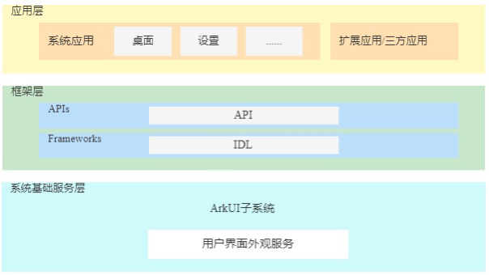

# 用户界面外观


## 简介

**内容介绍**：用户界面外观目前仅支持深色模式服务，提供了系统应用API，用于获取和设置系统的深浅色模式，同时可持久化保存当前配置的深浅色模式。

**架构图**：




## 目录

深色模式服务源代码在/foundation/arkui/ui\_appearance下，目录结构如下图所示：

```
/foundation/arkui/ui_appearance
├── etc
│   └── para             # 持久化配置文件存放目录
│── interfaces/kits
│   └── napi             # napi外部接口存放目录
│── sa_profile           # 深色模式系统服务的配置文件
│── services             # 深色模式系统服务实现
├── test                 # 接口单元测试
```


## 使用场景

仅支持具有权限的系统应用通过API接口控制和切换当前用户界面的外观模式。


## 说明

### 接口说明

| 接口名 | 描述 |
| -------- | -------- |
| setDarkMode(mode: DarkMode, callback: AsyncCallback\<void\>): void | 设置用户界面模式（深色或浅色），Callback方式。 |
| setDarkMode(mode: DarkMode): Promise\<void\> | 设置用户界面模式（深色或浅色），Promise方式。 |
| getDarkMode(): DarkMode | 获取当前用户界面的模式（深色或浅色）。 |

### 使用说明

功能模块开发指导可参考[**开发指南**](https://gitee.com/openharmony/docs/blob/master/zh-cn/application-dev/reference/apis/js-apis-uiappearance.md)


## 相关仓

[ArkUI框架子系统](https://gitee.com/openharmony/docs/blob/master/zh-cn/readme/ArkUI%E6%A1%86%E6%9E%B6%E5%AD%90%E7%B3%BB%E7%BB%9F.md)

[arkui\_napi](https://gitee.com/openharmony/arkui_napi)

[arkui\_ace\_engine](https://gitee.com/openharmony/arkui_ace_engine/blob/master/README_zh.md)

**arkui\_ui\_appearance**